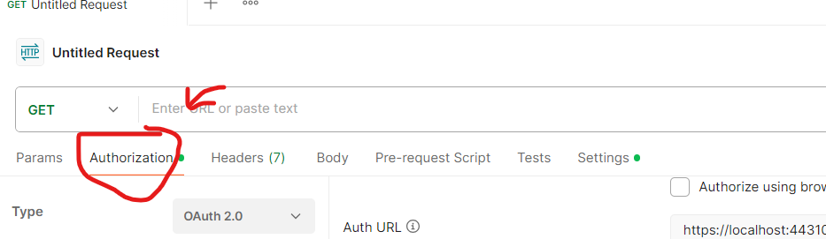
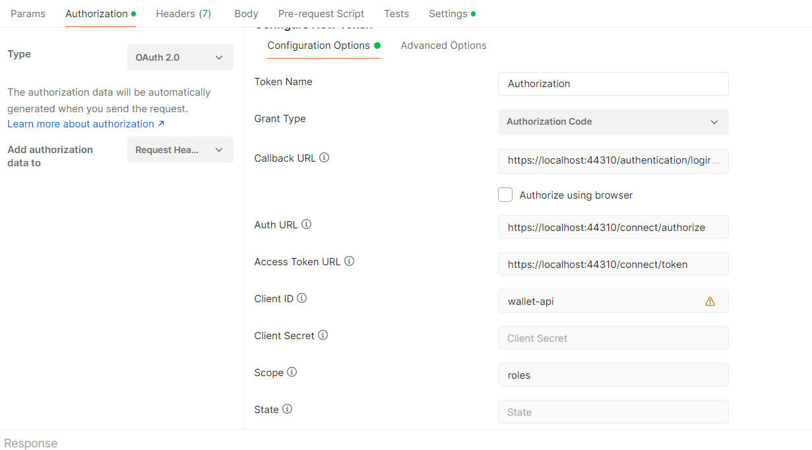
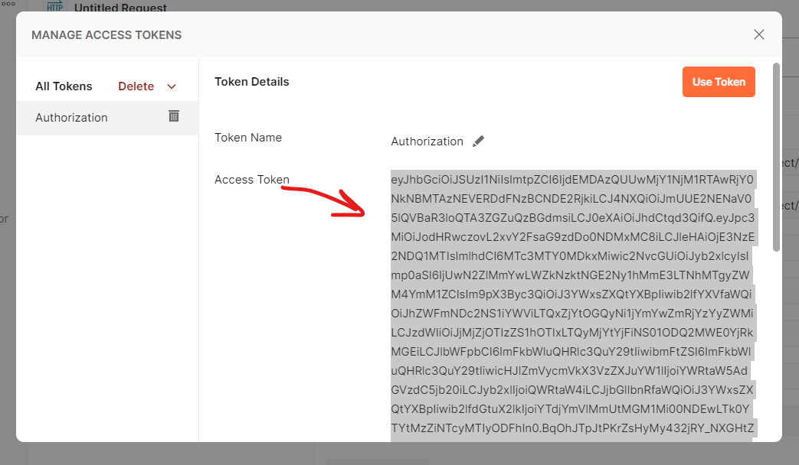
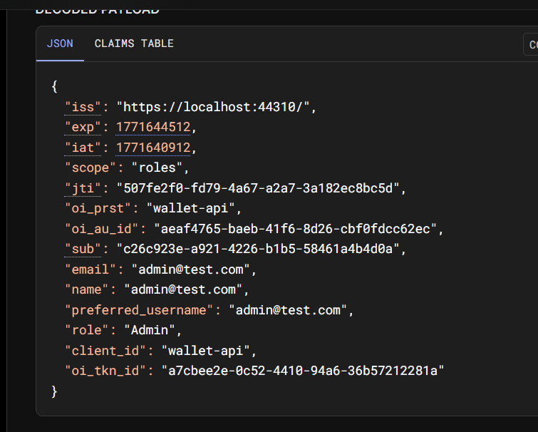

Instructions for using the OpenIddict with postman.

1. Go to the Authorization tab on a Request

2. Set the type to OAuth 2.0, and fill out the rest of the fields as shown
Grant Type: Authorization Code

Callback URL: https://localhost:44310/authentication/login-callback
Auth URL: https://localhost:44310/connect/authorize
Token URL: https://localhost:44310/connect/token
Client ID: wallet-api
Scope: roles
3. Run the WalletAPI.Auth Program.cs
4. Click Get New Access Token
5. Fill out the fields, either with the provided admin credentials, or register a new account
admin email: admin@test.com
password: Password1!
6. After a few seconds, the token will be shown, copy the Access Token and paste it into jwt.io

